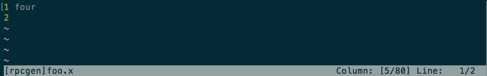
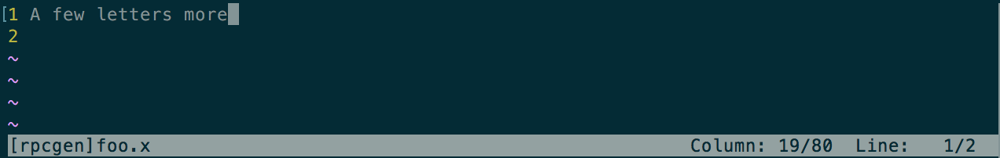

###What's This?

This is simply code for a vim statusline that lets you know if you're tab
aligned or not. If you're tab aligned your statusline will look like this:

... and if you're not it will look like this:

This tool can be used to write and maintain clean code, but it also
demonstrates how a feature of the statusline can be encapsulated in a Vimscript
function. I've been curious about this for a while, knowing that a statusline
of reasonable complexity could not be produced with "set statusline +=" alone,
so I am providing this example for others to study. Have fun, emacs is for
losers. 

